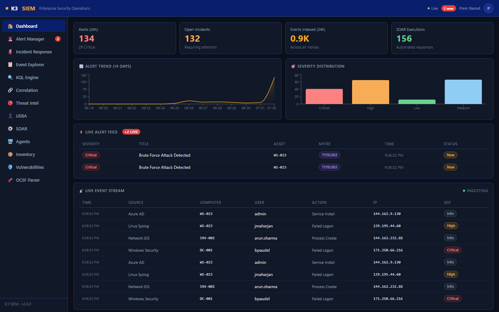
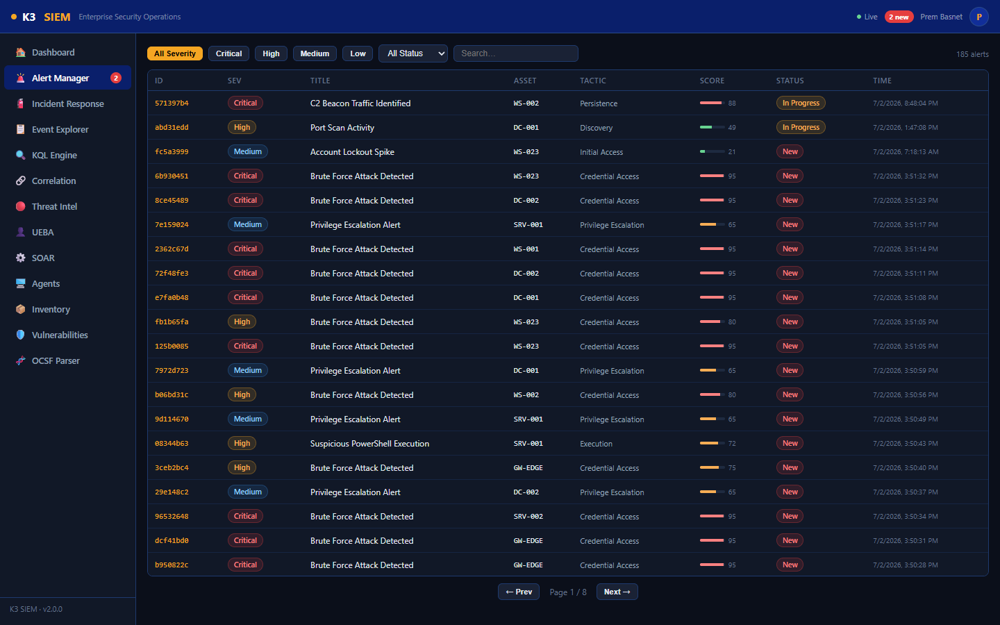
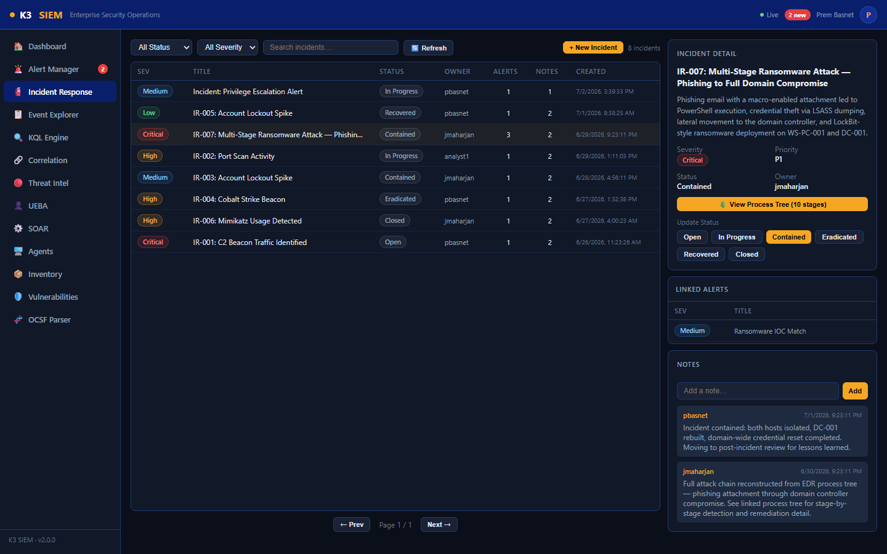
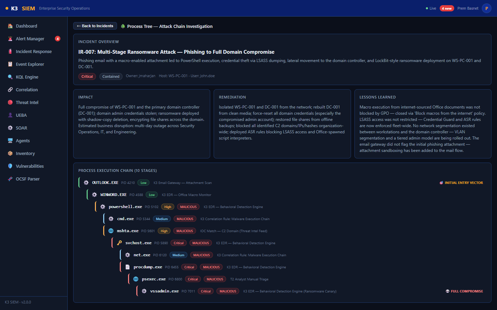
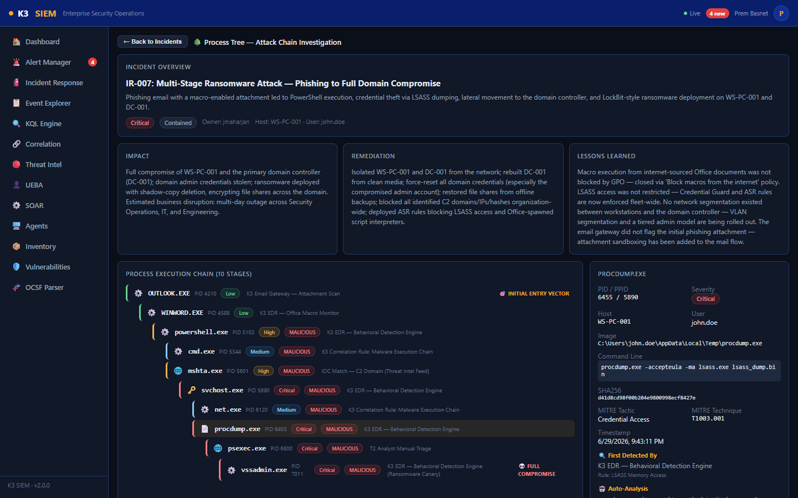
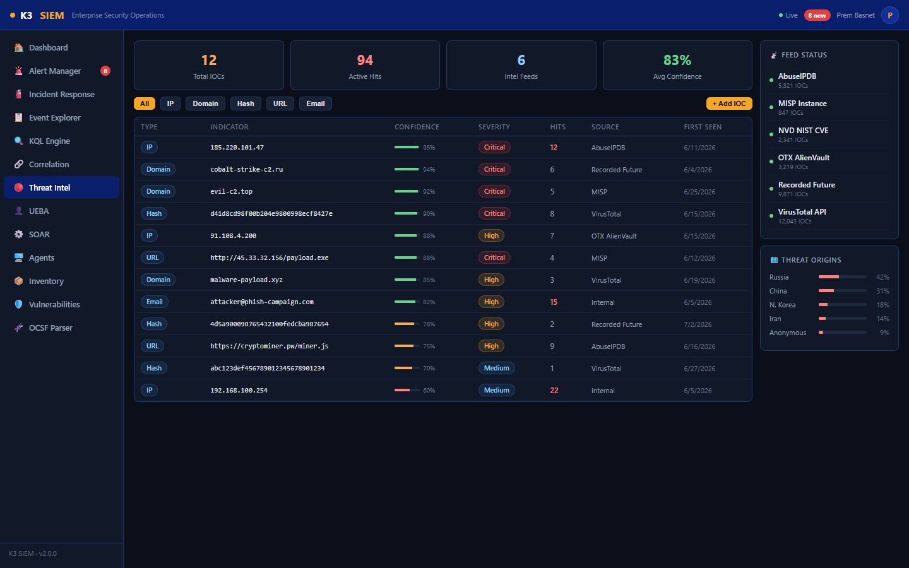
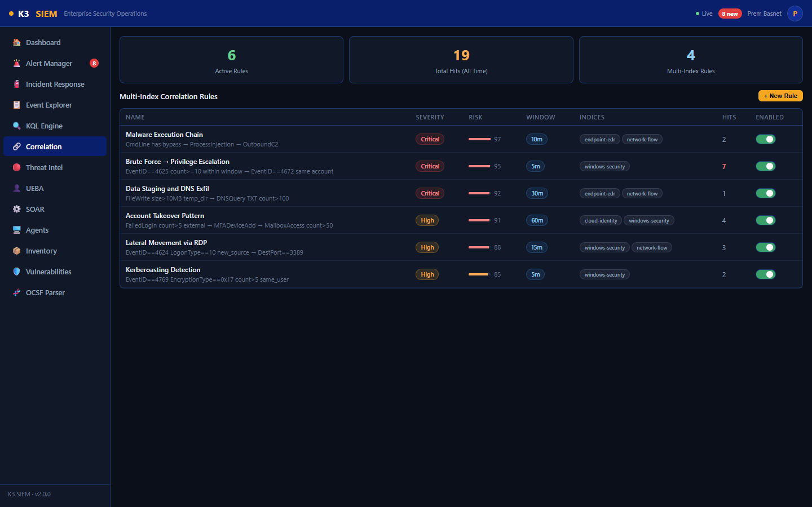
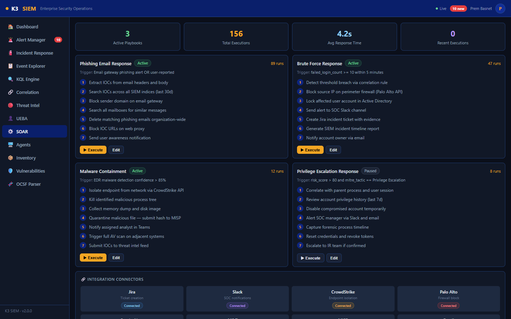
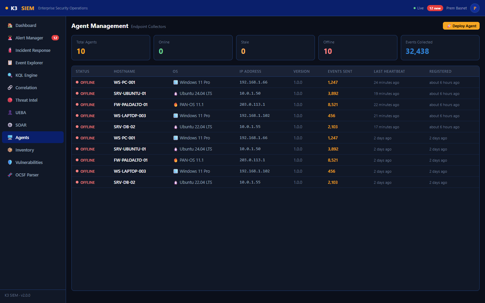
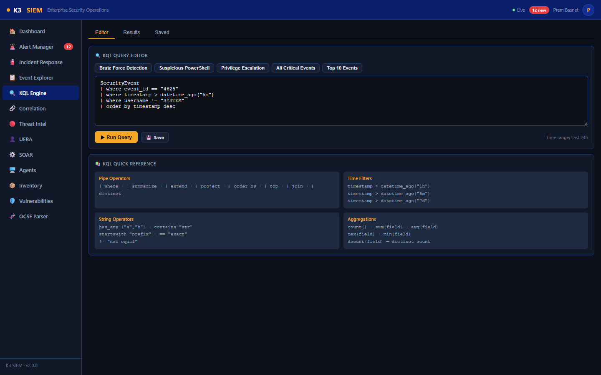

<p align="center">
  
  
  
</p>

<h1 align="center">🛡️ K3 SIEM Platform</h1>

<p align="center">
  <strong>Enterprise Security Information & Event Management</strong><br/>
  Real-time threat detection · Agent-based log collection · Incident response · SOAR automation
</p>

<p align="center">
  
  
  
  
  
  
</p>

---

## 📋 Table of Contents

- [Overview](#-overview)
- [Screenshots](#-screenshots)
- [Features](#-features)
- [Architecture](#-architecture)
- [Quick Start](#-quick-start)
- [Dashboard & Modules](#-dashboard--modules)
- [Agent System](#-agent-system)
- [API Reference](#-api-reference)
- [Configuration](#-configuration)
- [Login Credentials](#-login-credentials-local-dev--npm-run-seed-only)
- [Production Deployment](#-production-deployment)
- [Tech Stack](#-tech-stack)

---

## 🔭 Overview

K3 SIEM is a full-stack **Security Information and Event Management** platform inspired by **Microsoft Sentinel** and **SentinelOne**. It provides real-time security monitoring, threat detection, incident response, and automated playbook execution all from a unified dark-themed security operations interface. Analysts land on a unified **Triage Command Center**, and every chart, KPI tile, and table row across the dashboards is clickable straight through to the filtered alerts/incidents behind it.

### What Makes K3 SIEM Different

| Feature | Description |
|---------|-------------|
| 🎯 **Unified Triage Queue** | Alerts and incidents merged into one severity/SLA-sorted queue as the default landing page |
| 🕵️ **Agent-Based Collection** | Deploy Python agents on real endpoints (Windows/Linux/Network) to collect and forward logs |
| ⚡ **Real-Time Streaming** | WebSocket-powered live event and alert feeds zero polling |
| 🔍 **KQL Query Engine** | Kusto Query Language transpiled to SQL for threat hunting |
| 🤖 **SOAR Automation** | Execute playbooks with step-by-step progress tracking |
| 🧠 **UEBA Analytics** | ML-inspired user behavior analytics with anomaly scoring |
| 🎯 **MITRE ATT&CK Mapping** | Every alert mapped to MITRE tactics and techniques |
| 🛡️ **CVE Vulnerability Scanning** | Agents query the real NVD CVE API to surface exploitable software/OS versions per asset |
| 🧬 **OCSF Auto-Normalization** | Every ingested event is auto-classified and mapped onto the Open Cybersecurity Schema Framework |
| 📚 **Custom Dashboard Builder** | Drag-in widget dashboards from 5 built-in templates or build your own from 13 widget types |
| 👥 **Team-Scoped RBAC & SLA** | Alerts/incidents/agents scope to a team, with severity-based ack/resolve SLA targets and breach flags |
| 🖱️ **Clickable Dashboards** | Every chart, tile, and feed row drills straight into a pre-filtered Alerts/Incidents view |

---

## 📸 Screenshots

<table>
  <tr>
    <td width="50%"><strong>Security Operations Dashboard</strong><br/></td>
    <td width="50%"><strong>Alert Manager</strong><br/></td>
  </tr>
  <tr>
    <td width="50%"><strong>Incident Response</strong><br/></td>
    <td width="50%"><strong>🌳 Process Tree Attack Chain Investigation</strong><br/></td>
  </tr>
  <tr>
    <td width="50%"><strong>Process Tree Stage Detail Panel</strong><br/></td>
    <td width="50%"><strong>Threat Intelligence</strong><br/></td>
  </tr>
  <tr>
    <td width="50%"><strong>Correlation Engine</strong><br/></td>
    <td width="50%"><strong>SOAR Playbooks</strong><br/></td>
  </tr>
  <tr>
    <td width="50%"><strong>Agent Management</strong><br/></td>
    <td width="50%"><strong>KQL Query Engine</strong><br/></td>
  </tr>
</table>

---

## ✨ Features

### 🎯 Triage Command Center (Landing Page)
- **Default route (`/`)** alerts and incidents merged into a single severity/SLA-sorted work queue
- **4 Clickable KPI Tiles** Open Alerts, Open Incidents, Critical in Queue, SLA Breaches — click any tile to filter the queue in place; the SLA tile has its own togglable filter button too
- **Kind / Severity / Search Filters** plus an "⚠ SLA Breaches" toggle
- **Unified Detail Panel** for whichever row (alert or incident) is selected: metadata, SLA ack/resolve countdown with breach warnings, inline status updates, "Create Incident" from an alert, team reassignment (admin), and one-click SOAR playbook execution
- **🌳 Process Tree Link** for incidents with a reconstructed attack chain
- **📡 Related Raw Events** panel showing events tied to the selected item's asset/user/IP

### 📊 Security Operations Dashboard (`/overview`)
- **4 KPI Tiles**  Alerts (24h) with critical count, Open Incidents, Events Indexed (24h), SOAR Executions — each tile is clickable through to the matching filtered view
- **14-Day Alert Trend** Area chart showing alert volume over time click through to Alert Manager
- **Severity Distribution** Bar chart breakdown (Critical / High / Medium / Low / Info) — click a bar to open Alert Manager pre-filtered to that severity
- **⚡ Live Alert Feed** Real-time WebSocket stream of the latest 5 security alerts with MITRE technique tags click a row to jump straight to that alert's detail panel
- **📡 Live Event Stream** Top 10 raw events streaming live with green pulse indicator click a row to open Event Explorer filtered to that host/user/IP
- **🎯 Top MITRE Tactics** Ranked breakdown of MITRE ATT&CK tactics across all alerts click a tactic to filter Alert Manager to it
- **📊 Alert Status Summary** New / Assigned / In Progress / Closed counts click a status to filter Alert Manager
- **🔢 Platform Stats** IOC Hits, High-Risk Users, SOAR Runs, Events (24h) each links to its module
- **🖥️ Agent Status** and **📦 Asset Overview** tiles link to Agent Manager and Asset Inventory

### 🚨 Alert Manager
- **Severity Filters** Quick filter buttons: All, Critical, High, Medium, Low
- **Status Dropdown**  Filter by New, Assigned, In Progress, Closed
- **Free-Text Search** Search across alert title, asset, username, IP
- **MITRE Tactic Filter** driven by dashboard drill-throughs (shown as a clearable "Filtered from dashboard" chip)
- **URL Query-Param Filters** every filter (severity/status/tactic/search) and a selected alert (`?id=`) round-trip through the URL, so dashboard links and Triage Center hand-offs land you on exactly the right, shareable/bookmarkable view
- **Alert Table** ID, Severity badge, Title, Asset, MITRE Tactic, Risk Score (progress bar), Status, Timestamp
- **Pagination** 25 alerts per page with prev/next navigation
- **Live Alert Integration** New alerts from WebSocket prepended with deduplication, filtered to match the active view so a filtered drill-through doesn't get polluted by unrelated live rows
- **Detail Panel** Click any row to open side panel with:
  - Full alert metadata display
  - Status update buttons (New → Assigned → In Progress → Closed)
  - "Create Incident" button to escalate
  - Risk score visualization bar

### 🧯 Incident Response
- **Create Incidents** Form with title, description, severity (Critical/High/Medium/Low), priority (P1-P4)
- **Create from Alert** One-click incident creation from any alert
- **Incident List** Filterable by status, severity, search with alert/note counts
- **6-Stage Status Workflow** Open → In Progress → Contained → Eradicated → Recovered → Closed
- **Detail Panel** includes:
  - Incident metadata (severity, priority, status, owner)
  - Status progression buttons
  - **Linked Alerts Table** All associated security alerts
  - **Notes Section** Add timestamped investigation notes with author tracking
- **🌳 Process Tree Link** Incidents with a reconstructed attack chain show a "View Process
  Tree" button opening the full investigation view (see below)

### 🌳 Process Tree / Attack Chain Investigation
A CrowdStrike Falcon-style process execution tree for tracing a compromise from initial entry
to full compromise, reachable from any incident with a reconstructed attack chain.
- **Incident Overview** title, description, severity/status, host/user, plus rollup **Impact**,
  **Remediation**, and **Lessons Learned** cards
- **Process Execution Chain** an indented parent→child tree of every process the attacker
  spawned, color-coded by severity, malicious stages flagged, root labeled "🎯 Initial Entry
  Vector" and the terminal stage labeled "💀 Full Compromise"
- **Per-Stage Detail Panel** click any process to see PID/PPID, image path, command line,
  host/user, SHA256, MITRE tactic/technique, timestamp, and:
  - **🔍 First Detected By** the detection engine/rule/analyst that caught this stage
  - **🤖 Auto-Analysis** a plain-language explanation of why the stage is suspicious
  - **💥 Impact**, **🛠️ Remediation**, and **📘 Lessons Learned** for that specific stage

### 📋 Event Explorer
- **50 events per page** with pagination
- **Filters**: Free-text search (user/computer/IP/action), severity dropdown, index selector
- **5 Log Indices**: `windows-security`, `linux-syslog`, `network-flow`, `endpoint-edr`, `cloud-identity`
- **Live Event Overlay** Top 10 new events highlighted in green with streaming indicator
- **Columns**: Timestamp, Index badge, Source, Event ID (gold monospace), Computer, User, Action, IP, Severity badge
- **Total Count** display with refresh button

### 🔍 KQL Query Engine
- **Three Tabs**: Editor, Results, Saved Queries
- **Query Editor** Monospace text area with dark theme
- **Sample Queries** Quick-load buttons for common threat hunting queries
- **Supported KQL Operators**:
  - `| where event_id == "4625"` — Exact match
  - `| where severity == "Critical"` — Severity filter
  - `| where timestamp > datetime_ago("5m")` — Time window (m/h/d)
  - `| where action has_any ("PowerShell", "bypass")` — OR text search
  - `| where username != "SYSTEM"` — Negation
  - `| where agent_id == "..."` — Filter by agent
  - `| top 10` — Limit results
  - `| project timestamp, computer...` — Column selection (planned)
- **Results Table** Query output with execution time and row count
- **Saved Queries** Save queries as reusable detection rules with categories
- **Quick Reference Guide** Built-in KQL syntax help panel

### 🔗 Correlation Engine
- **Stats**: Active Rules count, Total Hits (all time), Multi-Index Rules count
- **Create Rules** Name, correlation logic, severity, risk score (0-100), time window (minutes)
- **Rules Table**: Name + logic description, Severity badge, Risk score bar, Window, Index badges, Hit count, Enable/Disable toggle
- **Multi-Index Correlation** Rules span across `windows-security`, `network-flow`, etc.
- **Built-in Detection Rules**:
  - 🔐 Brute Force Detection (3+ failed logins in 5 min)
  - 🔄 Lateral Movement via RDP
  - 📤 Data Exfiltration (high volume outbound)
  - 🦠 Malware Execution Chain
  - 👤 Account Takeover Pattern
  - 🎫 Kerberoasting Attack
- **RBAC** Only admin/t2_analyst can create or toggle rules

### 🔴 Threat Intelligence
- **IOC Stats**: Total IOCs, Active Hits, Intel Feeds count, Average Confidence %
- **Type Filters** All, IP, Domain, Hash, URL, Email
- **Add IOC Form** Type, value, confidence (0-100%), severity, source, description
- **IOC Table**: Type badge, Indicator (monospace), Confidence bar, Severity, Hits (red if >10), Source, First Seen
- **📡 Feed Status Panel** Feed name, IOC count, active/inactive indicator
  - MISP, VirusTotal, AbuseIPDB, OTX AlienVault, Recorded Future, NVD NIST
- **🗺️ Threat Origins** Geographic breakdown: Russia, China, N. Korea, Iran, Anonymous

### 👤 UEBA (User & Entity Behavior Analytics)
- **Stats**: High Risk Users, Total Anomalies, Users Monitored
- **Sort Options**: Risk Score, Anomalies, Name
- **User Risk Table**: Username, Department, Risk Score (color-coded bar), Anomaly count badge, Behavior flags, Location, Last Active
- **🧠 ML Baseline Deviations**:
  - Login Time Anomaly Off-hours access detection
  - Geo-Velocity Impossible travel detection
  - Peer Group Deviation File access pattern outliers
  - Data Volume Spike Download volume exceeding 30-day baseline

### ⚙️ SOAR (Security Orchestration, Automation & Response)
- **Stats**: Active Playbooks, Total Executions, Avg Response Time, Recent Executions
- **Playbook Grid** (2 columns):
  - Name + status badge (Active/Paused) + execution count
  - Trigger condition display
  - **Live Execution Progress** Step-by-step progress bar with completion percentage
  - Numbered step circles (completed = green checkmark ✓)
  - Execute / Edit buttons (role-gated)
- **Built-in Playbooks**:
  - 🔐 Brute Force Response Block IP, reset password, create ticket, notify SOC
  - 🦠 Malware Containment Isolate endpoint, collect forensics, block hash, alert team
  - 🎣 Phishing Response Extract IOCs, block sender, scan mailboxes, update filters
  - 🔑 Privilege Escalation Revoke tokens, audit access, reset credentials, review logs
- **🔗 Integration Connectors** (8):
  - Jira (ticket creation), Slack (SOC notifications), CrowdStrike (endpoint isolation)
  - Palo Alto (firewall block), ServiceNow (ITSM), MS Teams (notifications)
  - MISP (IOC sharing), Email (analyst alerts)
- **📋 Execution History** Playbook ID, triggered by, status, steps completed, timestamps

### 🖥️ Agent Management
- **Agent Stats**: Total Agents, Online (green), Stale (yellow), Offline (red), Events Collected
- **Agent Table**: Status (pulsing dot), Hostname, OS (with icon 🪟🐧🔥), IP, Version, Events Sent, Last Heartbeat, Registered
- **Status Computation**: Online (<60s), Stale (1-5min), Offline (>5min) — computed from heartbeat
- **Detail Panel**: Agent ID, OS info, collected sources, tags, recent events feed
- **Auto-Alerting**: High severity alert generated when agent goes offline (Defense Evasion tactic)
- **Admin Controls**: Remove agent button (admin only), update tags/config (admin/t2)
- **🔌 Remote Deploy** One-click agent rollout straight from the UI, two tabs:
  - **SSH** — provide target IP/OS/credentials and the backend (`ssh2`) connects out, installs
    Python + dependencies, and starts the agent as a background process, with live deployment
    status polling
  - **Install Script** — generates a copy-paste `curl | bash` / PowerShell one-liner per OS for
    environments where inbound SSH from the SIEM isn't allowed

### 🛡️ Vulnerability Scanner & Asset Inventory
- **Real CVE Matching** agents query the live [NVD CVE API](https://nvd.nist.gov/) for every
  piece of installed software and the host OS, rescanning roughly every 30 minutes; simulated
  agents use a curated, realistic CVE dataset instead so demos work without network egress
- **`K3_VULN_SCAN`** toggles scanning on/off per agent; **`K3_NVD_API_KEY`** raises the NVD rate
  limit from 5 to 50 requests/30s
- **Vulnerability Table**: CVE ID, affected software/OS + version, CVSS score, severity
  (Critical/High/Medium/Low), publish/modified dates, filterable by agent/severity/search
- **Asset Inventory**: hardware (CPU, RAM, disk), OS, installed software, running services, open
  ports, local users, AV/firewall status, domain, and per-asset compliance rollup
- **Compliance Scoring** an asset counts as compliant when firewall is enabled and antivirus is
  active — surfaced as a fleet-wide compliance percentage

### 🧬 OCSF Auto-Parser
- Every event ingested — real agent logs or synthetic demo data — is auto-normalized onto the
  [Open Cybersecurity Schema Framework](https://schema.ocsf.io) (v1.3.0) alongside the raw log,
  with no per-source parser configuration required
- **Format Auto-Detection**: Windows `wevtutil` JSON, journald JSON, syslog/`auth.log` text, CEF,
  generic JSON, or raw text
- **Class Auto-Classification**: Authentication, Process Activity, File System Activity,
  Scheduled Job Activity, Network Activity, DNS Activity, Security Finding, or Base Event
- **OCSF Parser Page**: paste any raw log line and see it mapped to its OCSF class/category,
  activity, severity, status, actor, endpoints, and observables live

### 📚 Custom Dashboard Builder
- **Dashboard Gallery** browse 5 built-in templates or your own saved dashboards; clone a
  template into an editable copy with one click
- **Built-in Templates**: SOC Overview (10 widgets), Threat Hunting (6), Vulnerability &
  Compliance (4), Agent Fleet Health (5), Identity & UEBA (4)
- **13 Widget Types**: KPI tile, alert trend, severity bar, MITRE tactics, alert status, agent
  status, asset overview, vulnerability summary, IOC feed, alerts table, events table, live alert
  feed, live event stream
- **Drag-and-drop Grid** 1–4 column widget spans (`sm`/`md`/`lg`/`full`), share/unshare with the
  team, edit or delete your own dashboards
- **Fully Clickable** every widget on a custom dashboard drills through to the underlying,
  pre-filtered Alerts/Incidents/Events/Agents/Inventory view — same click-through behavior as the
  built-in Overview dashboard

### 👥 Team Management & SLA Tracking
- **Teams** (admin-only CRUD under Admin → Teams & Users) group analysts, agents, and incidents
- **Team-Scoped RBAC** T1/T2 analysts only see alerts (via their originating agent's team),
  incidents, and agents belonging to their team, plus anything unassigned (a shared inbox
  visible to everyone) — enforced server-side in every list/detail endpoint, not just hidden in
  the UI
- **SLA Targets by Severity** (time-to-acknowledge / time-to-resolve): Critical 15m / 4h, High
  30m / 8h, Medium 2h / 24h, Low & Info 8h / 72h
- **Breach Flags** surfaced on every alert/incident in Triage Center, Alert Manager, and Incident
  Response — once breached, an item stays flagged even after it's eventually acknowledged/closed

---

## 🏗️ Architecture

```
k3-siem/
│
├── 🔧 backend/                         # Node.js + Express API Server
│   ├── src/
│   │   ├── index.js                     # Express + WebSocket + startup
│   │   ├── config.js                    # 🔑 Required-secret validation (JWT_SECRET etc.)
│   │   ├── models/
│   │   │   └── db.js                    # Dual-dialect DB (SQLite + PostgreSQL) + migrations
│   │   ├── data/
│   │   │   └── dashboardTemplates.js    # 📚 5 built-in custom-dashboard templates
│   │   ├── routes/
│   │   │   ├── auth.js                  # 🔐 JWT authentication (login, /me)
│   │   │   ├── events.js                # 📋 Log ingestion + KQL engine
│   │   │   ├── agents.js                # 🖥️ Agents, assets, vulnerabilities
│   │   │   ├── deploy.js                # 🚀 SSH / script-based remote agent deploy
│   │   │   ├── ocsf.js                  # 🧬 OCSF parse/query endpoints
│   │   │   ├── dashboardLibrary.js      # 📚 Custom dashboard CRUD + templates
│   │   │   ├── teams.js                 # 👥 Team CRUD (admin)
│   │   │   ├── users.js                 # 👤 User list/role management (admin)
│   │   │   └── api.js                   # 🛡️ Alerts, Incidents, IOCs, SOAR, UEBA, Correlation
│   │   ├── services/
│   │   │   ├── ingestion.js             # ⚡ Live event generation (demo mode)
│   │   │   ├── correlationEngine.js     # 🔗 Detection-rule evaluation (30s cycle)
│   │   │   ├── iocMatcher.js            # 🔴 IOC matching against ingested events
│   │   │   ├── userRiskEngine.js        # 🧠 Statistical UEBA risk scoring
│   │   │   ├── agentMonitor.js          # 💓 Agent health monitoring
│   │   │   ├── deployer.js              # 🚀 SSH-based remote agent installer
│   │   │   ├── slaPolicy.js             # ⏱️ Severity-based SLA target/breach calc
│   │   │   ├── teamScope.js             # 👥 Team-scoped RBAC query helpers
│   │   │   ├── audit.js                 # 📝 Admin audit log
│   │   │   ├── retention.js             # 🧹 Nightly event/alert purge
│   │   │   ├── geoip.js                 # 🌍 IP → geo lookup for UEBA geo-velocity
│   │   │   ├── ocsfParser.js            # 🧬 Raw log → OCSF schema mapper
│   │   │   └── connectors/              # 🔌 Slack, Teams, Jira, ServiceNow, Email, MISP,
│   │   │       ├── ...                  #    CrowdStrike, Palo Alto, VirusTotal, AbuseIPDB, OTX
│   │   ├── middleware/
│   │   │   └── auth.js                  # 🔑 JWT middleware + RBAC
│   │   └── utils/
│   │       └── seed.js                  # 🌱 Demo data seeder
│   └── data/                            # SQLite database (local dev)
│
├── 🎨 frontend/                         # React 18 SPA
│   └── src/
│       ├── components/
│       │   ├── Triage/TriageCenter.jsx  # 🎯 Unified alert+incident queue (landing page)
│       │   ├── Dashboard/Dashboard.jsx  # 📊 KPI tiles, charts, live feeds (`/overview`)
│       │   ├── Dashboards/              # 📚 Custom dashboard builder
│       │   │   ├── DashboardGallery.jsx #    Browse templates + saved dashboards
│       │   │   ├── DashboardBuilder.jsx #    Add/configure/arrange widgets
│       │   │   ├── DashboardViewer.jsx  #    Read-only rendered view
│       │   │   ├── DashboardGrid.jsx    #    Responsive widget grid layout
│       │   │   └── widgets/WidgetRenderer.jsx # 13 widget types, all click-through
│       │   ├── Alerts/AlertManager.jsx  # 🚨 Alert table + detail panel (URL-filterable)
│       │   ├── Agents/AgentManager.jsx  # 🖥️ Agent management + remote deploy UI
│       │   ├── Inventory/
│       │   │   ├── AssetInventory.jsx   # 📦 Hardware/software/compliance per asset
│       │   │   └── VulnerabilityScanner.jsx # 🛡️ CVE findings table
│       │   ├── OCSF/OCSFParser.jsx      # 🧬 Paste-a-log OCSF normalization view
│       │   ├── Admin/TeamManagement.jsx # 👥 Team CRUD + user role assignment
│       │   ├── Investigation/ProcessTree.jsx # 🌳 Attack chain process tree
│       │   ├── KQL/KQLEngine.jsx        # 🔍 Query editor + results
│       │   ├── Layout/Layout.jsx        # 📐 Topbar + sidebar navigation
│       │   ├── Layout/Auth.jsx          # 🔐 Login + auth context
│       │   └── Pages.jsx                # 📄 Events, Incidents, Correlation,
│       │                                #    Threat Intel, UEBA, SOAR
│       ├── hooks/useWebSocket.js        # 🔌 WebSocket connection hook
│       └── services/api.js              # 📡 Axios API client
│
├── 🐍 k3-agent/                         # Python Endpoint Agent
│   ├── agent.py                         # 🕵️ Cross-platform log collector + CVE scanner
│   ├── config.yaml                      # ⚙️ Agent configuration
│   ├── requirements.txt                 # 📦 Python dependencies
│   └── Dockerfile                       # 🐳 Agent container image
│
├── 🐳 docker-compose.yml               # PostgreSQL + App + 3 Agents
├── 🐳 Dockerfile                        # Multi-stage Node.js build (non-root, healthcheck)
├── 🪟 start.bat                         # Windows dev startup
├── 🐧 start.sh                          # Linux/Mac dev startup
└── 📦 package.json                      # Workspace root
```

### System Flow

```
┌─────────────────────────────────────────────────────────────────┐
│                        ENDPOINTS                                 │
│                                                                   │
│  🪟 Windows Agent     🐧 Linux Agent      🔥 Network Agent      │
│  (WS-PC-001)          (SRV-UBUNTU-01)     (FW-PALOALTO-01)      │
│  Event Logs           syslog / auth.log    Firewall logs          │
│  CrowdStrike EDR      OSSEC HIDS           Cisco ASA              │
└──────┬─────────────────────┬──────────────────────┬──────────────┘
       │                     │                      │
       │     HTTP POST /api/events/ingest           │
       │     + X-Api-Key + X-Agent-Id               │
       │     + /agents/:id/inventory + /vulnerabilities (CVE scan → NVD)
       └──────────────────┬──┬──────────────────────┘
                          │  │
                    ┌─────▼──▼─────┐
                    │  K3 SIEM API  │
                    │  (Express)    │
                    │              │
                    │ ┌──────────┐ │    ┌──────────────┐
                    │ │ Ingest + │─┼───▶│ PostgreSQL   │
                    │ │ OCSF map │ │    │ / SQLite     │
                    │ └──────────┘ │    └──────────────┘
                    │ ┌──────────┐ │
                    │ │Correlate │ │◀── Brute Force / PowerShell /
                    │ │ Engine   │ │    Privilege Escalation rules
                    │ └──────────┘ │
                    │ ┌──────────┐ │
                    │ │Agent Mon │ │◀── Offline detection + alerting
                    │ └──────────┘ │
                    │ ┌──────────┐ │
                    │ │Team Scope│ │◀── RBAC filter on every alert/
                    │ │+ SLA Calc│ │    incident/agent query
                    │ └──────────┘ │
                    └──────┬───────┘
                           │ WebSocket /ws
                    ┌──────▼───────┐
                    │  React SPA   │
                    │  Triage      │
                    │  Dashboards  │
                    │  Alerts      │
                    │  Incidents   │
                    │  Agents      │
                    │  Inventory   │
                    │  KQL Engine  │
                    │  SOAR        │
                    └──────────────┘
```

---

## 🚀 Quick Start

### Option 1: Docker (Recommended)

```bash
git clone https://github.com/astrax3v2/k3-siem.git
cd k3-siem

# Required docker-compose refuses to start without these set.
cp .env.example .env
# Edit .env: set POSTGRES_PASSWORD, JWT_SECRET, INGEST_API_KEY, CORS_ORIGIN
# (or generate them: openssl rand -base64 48 / openssl rand -hex 32 / openssl rand -base64 24)
# For a local demo, set DEMO_MODE=true to also get synthetic events/alerts.

docker-compose up --build
```

This starts **5 containers**:
| Container | Description | Port |
|-----------|-------------|------|
| 🐘 `db` | PostgreSQL 16 database | 5432 (internal) |
| 🛡️ `app` | K3 SIEM backend + frontend (`/health`, `/ready` healthcheck) | **3001** |
| 🪟 `agent-windows` | Simulated Windows endpoint (WS-PC-001) + CVE scan | — |
| 🐧 `agent-linux` | Simulated Linux server (SRV-UBUNTU-01) + CVE scan | — |
| 🔥 `agent-network` | Simulated network device (FW-PALOALTO-01) + CVE scan | — |

Open **http://localhost:3001** → Login with `pbasnet` / `K3@2026`

### Option 2: Local Development (SQLite)

```bash
# Requires Node.js >= 22

# Windows
start.bat

# Linux / Mac
chmod +x start.sh && ./start.sh
```

Backend starts on `:3001`, frontend on `:3000`.

### Option 3: Deploy Real Agents

```bash
cd k3-agent
pip install -r requirements.txt

# Collect real logs from this machine
python agent.py --config config.yaml

# Simulate a Windows endpoint
python agent.py --simulate --simulate-os windows

# Simulate a Linux server
python agent.py --simulate --simulate-os linux

# Simulate a network device
python agent.py --simulate --simulate-os network

# Disable the NVD CVE vulnerability scan (on by default), or supply an NVD API key
# to raise the rate limit from 5 to 50 requests/30s
K3_VULN_SCAN=false python agent.py --config config.yaml
K3_NVD_API_KEY=<your-nvd-key> python agent.py --config config.yaml
```

Prefer not to touch the target machine's shell? Log in as `admin` or `t2_analyst` and use
**Agent Manager → 🔌 Remote Deploy** instead — it installs and starts the agent over SSH (or
hands you a copy-paste install script) straight from the UI. See "Remote Deployment (SSH)" under
[Agent System](#-agent-system) below.

---

## 📸 Dashboard & Modules

### 🎯 Triage Center (Landing Page)
| Section | Details |
|---------|---------|
| **KPI Tiles** | Open Alerts · Open Incidents · Critical in Queue · SLA Breaches all clickable, filter the queue in place |
| **Unified Queue** | Alerts + incidents, severity/SLA sorted, kind/severity/search/breach filters |
| **Detail Panel** | Metadata · SLA countdown & breach warning · status updates · team reassignment · playbook execution |

### 📊 Dashboard (`/overview`)
| Section | Details |
|---------|---------|
| **KPI Tiles** | Alerts (24h) · Open Incidents · Events Indexed · SOAR Executions click through to each module |
| **Alert Trend Chart** | 14-day area chart with gradient fill click to open Alert Manager |
| **Severity Chart** | Bar chart: Critical (red), High (orange), Medium (blue), Low (green) click a bar to filter Alert Manager |
| **Live Alert Feed** | Real-time WebSocket stream with MITRE technique badges click a row to open that alert |
| **Live Event Stream** | Raw events with green pulse animation click a row to open Event Explorer filtered to it |
| **MITRE Tactics** | Ranked breakdown with horizontal progress bars click to filter Alert Manager by tactic |
| **Alert Status** | New / Assigned / In Progress / Closed counts click to filter by status |
| **Platform Stats** | IOC Hits · High-Risk Users · SOAR Runs · Events (24h) each links to its module |

### 🚨 Alert Manager
| Feature | Details |
|---------|---------|
| **Filters** | Severity buttons · Status dropdown · MITRE tactic (from dashboard links) · Free-text search |
| **URL-Synced** | Filters and a selected alert id round-trip through the URL — shareable, bookmarkable, deep-linkable |
| **Table Columns** | Severity badge · Title · Asset · MITRE Tactic · Risk Score bar · Status · Time |
| **Detail Panel** | Full metadata · Status update buttons · Create Incident · Risk visualization |
| **Live Updates** | New alerts prepended via WebSocket with deduplication, filtered to match the active view |

### 🛡️ Vulnerability Scanner
| Feature | Details |
|---------|---------|
| **CVE Source** | Real NVD CVE API lookups per installed software/OS (simulated agents use a curated dataset) |
| **Table Columns** | CVE ID · Software/OS + version · CVSS score · Severity · Published/modified · Status |
| **Filters** | Agent · Severity · Free-text search across CVE ID/software/description |
| **Stats** | Total, Critical/High/Medium/Low counts, affected asset count |

### 📦 Asset Inventory
| Feature | Details |
|---------|---------|
| **Hardware/OS** | CPU, cores, RAM, disk used/total, uptime, domain, serial number |
| **Software** | Installed software, running services, open ports, local users |
| **Compliance** | Firewall/antivirus status rolled up into a fleet-wide compliance percentage |
| **Per-Asset Detail** | Linked agent status/heartbeat + that asset's vulnerability findings |

### 🧬 OCSF Parser
| Feature | Details |
|---------|---------|
| **Auto-Detect** | Windows wevtutil JSON, journald JSON, syslog/auth.log, CEF, generic JSON, raw text |
| **Auto-Classify** | Authentication, Process/File/Scheduled-Job Activity, Network/DNS Activity, Security Finding |
| **Live Preview** | Paste a raw log line, see its OCSF class/category/activity/severity/actor/observables |
| **Ingest-Time** | Every ingested event (real or synthetic) is normalized alongside its raw log automatically |

### 📚 Custom Dashboard Builder
| Feature | Details |
|---------|---------|
| **Templates** | SOC Overview (10 widgets) · Threat Hunting (6) · Vulnerability & Compliance (4) · Agent Fleet Health (5) · Identity & UEBA (4) |
| **Widget Types** | 13 total  KPI tile, alert trend, severity bar, MITRE tactics, alert status, agent status, asset overview, vuln summary, IOC feed, alerts/events tables, live alert/event feeds |
| **Grid Layout** | `sm`/`md`/`lg`/`full` widget spans on a 4-column grid |
| **Sharing** | Save, edit, share/unshare, or delete your own dashboards |
| **Clickable** | Every widget drills through to its filtered Alerts/Incidents/Events/Agents/Inventory view |

### 👥 Team Management & SLA
| Feature | Details |
|---------|---------|
| **Teams** | Admin-only CRUD; assign users and agents to a team |
| **RBAC Scope** | T1/T2 analysts see only their team's alerts/incidents/agents, plus unassigned shared items |
| **SLA Targets** | Critical 15m/4h · High 30m/8h · Medium 2h/24h · Low & Info 8h/72h (ack/resolve) |
| **Breach Flags** | Shown on Triage Center, Alert Manager, and Incident Response rows and detail panels |

### 🌳 Process Tree
| Feature | Details |
|---------|---------|
| **Overview** | Incident title/description/severity/status + Impact · Remediation · Lessons Learned cards |
| **Attack Chain Tree** | Indented parent→child process tree, severity-colored, malicious stages flagged |
| **Markers** | Root = "🎯 Initial Entry Vector" · terminal malicious stage = "💀 Full Compromise" |
| **Stage Detail Panel** | PID/PPID · image · command line · SHA256 · MITRE mapping · first detected by · auto-analysis |

### 🖥️ Agent Manager
| Feature | Details |
|---------|---------|
| **Stats Row** | Total · Online (🟢) · Stale (🟡) · Offline (🔴) · Events Collected |
| **Agent Table** | Status dot · Hostname · OS icon · IP · Version · Events · Heartbeat · Registered |
| **Detail Panel** | Agent ID · OS · IP · Sources · Tags · Recent 10 events feed |
| **Health Monitor** | Auto-marks offline after 5 min · Creates High severity alert |

### 🔍 KQL Engine
| Feature | Details |
|---------|---------|
| **Editor** | Dark monospace textarea with sample query buttons |
| **Operators** | `where`, `has_any`, `datetime_ago`, `!=`, `==`, `top`, `project` |
| **Results** | Table output with execution time (ms) and row count |
| **Saved Queries** | Persist as detection rules with categories |

### 🧯 Incident Response
| Feature | Details |
|---------|---------|
| **Create** | Title · Description · Severity · Priority (P1-P4) |
| **Workflow** | Open → In Progress → Contained → Eradicated → Recovered → Closed |
| **Detail** | Metadata · Linked alerts table · Investigation notes with timestamps |

### ⚙️ SOAR Playbooks
| Feature | Details |
|---------|---------|
| **Playbooks** | Brute Force · Malware · Phishing · Privilege Escalation |
| **Execution** | Live progress bar · Step checkmarks · Completion message |
| **Connectors** | Jira · Slack · CrowdStrike · Palo Alto · ServiceNow · Teams · MISP · Email |

### 🔴 Threat Intelligence
| Feature | Details |
|---------|---------|
| **IOC Types** | IP · Domain · Hash · URL · Email with type badges |
| **Feeds** | MISP · VirusTotal · AbuseIPDB · OTX · Recorded Future · NVD NIST |
| **Metrics** | Confidence bars · Hit counts · Threat origin map |

### 👤 UEBA
| Feature | Details |
|---------|---------|
| **Risk Scoring** | 0-100 color-coded bars (green → orange → red) |
| **Anomaly Detection** | Login time · Geo-velocity · Peer group · Data volume |
| **Flags** | Behavior flags per user with anomaly count badges |

---

## 🕵️ Agent System

### How It Works

1. **Agent starts** → Registers with SIEM via `POST /api/agents/register`
2. **Heartbeat loop** → Sends heartbeat every 30s via `POST /api/agents/:id/heartbeat`
3. **Collection loop** → Collects logs every 8-15s based on OS detection
4. **Normalization** → Maps OS-specific log formats to unified SIEM schema, then to OCSF
5. **Ingestion** → Batch `POST /api/events/ingest` with `X-Agent-Id` header
6. **Inventory** → Reports hardware/OS/software snapshot via `POST /api/agents/:id/inventory`
7. **CVE Scan** → Background thread matches installed software/OS against the NVD CVE API (or a
   simulated dataset), reports findings via `POST /api/agents/:id/vulnerabilities` roughly every
   30 minutes
8. **Monitoring** → Backend checks heartbeats every 60s, marks offline after 5 min

### Supported Log Sources

| Platform | Sources | Method |
|----------|---------|--------|
| 🪟 **Windows** | Security, System, Application Event Logs | `wevtutil` / PowerShell |
| 🐧 **Linux** | syslog, auth.log, secure | `journalctl` / file tailing |
| 📦 **Application Logs** | IIS, nginx, MySQL/Postgres, Docker, and other installed apps | Auto-discovered on the agent's host (`auto_discover_app_logs`) |
| 🔥 **Network** | Firewall, IDS, DNS, VPN | Simulated (extensible) |
| ☁️ **Cloud** | Azure AD, AWS CloudTrail | Simulated (extensible) |

### Simulation Profiles

| Profile | Hostname | OS | Sample Actions |
|---------|----------|----|----------------|
| `windows` | WS-PC-001 | Windows 11 Pro | User Logon, Failed Logon, PowerShell Exec, Service Install |
| `linux` | SRV-UBUNTU-01 | Ubuntu 24.04 LTS | SSH Login, Sudo Command, Cron Execution, Package Install |
| `network` | FW-PALOALTO-01 | PAN-OS 11.1 | Traffic Allow/Deny, IDS Alert, Port Scan, DDoS Attempt |

### Agent Configuration

```yaml
# k3-agent/config.yaml
siem_url: http://localhost:3001
api_key: k3-ingest-key
agent_version: "1.0.0"

collection_interval: 10    # seconds between collection cycles
heartbeat_interval: 30     # seconds between heartbeats
batch_size: 50             # max events per batch

sources:
  - windows_security
  - windows_system
  - windows_application
  - linux_syslog
  - linux_auth
  - app_logs

# App log discovery: ships logs from installed applications (IIS, nginx,
# MySQL/Postgres, Docker, etc.) found on the agent's machine, in addition
# to the OS-level sources above.
auto_discover_app_logs: true
app_log_paths: []
app_log_max_files: 40

simulate: false
```

### Environment Variables (Agent)

| Variable | Default | Description |
|----------|---------|-------------|
| `K3_SIEM_URL` | `http://localhost:3001` | SIEM backend URL |
| `K3_API_KEY` | `k3-ingest-key` | Ingest API key |
| `K3_HOSTNAME` | System hostname | Override agent hostname |
| `K3_SIMULATE` | `false` | Enable simulation mode |
| `K3_SIMULATE_OS` | — | Simulation profile: `windows`, `linux`, `network` |
| `K3_COLLECTION_INTERVAL` | `10` | Seconds between log collection |
| `K3_HEARTBEAT_INTERVAL` | `30` | Seconds between heartbeats |
| `K3_VULN_SCAN` | `true` | Enable/disable the CVE vulnerability scan |
| `K3_NVD_API_KEY` | — | NVD API key — raises the CVE lookup rate limit from 5 to 50 req/30s |
| `K3_STATE_PATH` | `agent_state.json` | Where the agent persists its registered `agent_id` across restarts |

### 🛡️ Vulnerability Scanning

- Runs on a background thread right after startup, then roughly every 30 minutes
  (`vuln_interval` at the default 10s collection interval)
- **Real mode** (`simulate: false`): calls the public [NVD CVE API](https://services.nvd.nist.gov/rest/json/cves/2.0)
  with a `keywordSearch` per installed software item and the host OS, extracting CVSS v3.1/v3.0/v2
  scores and severity
- **Simulate mode**: returns a curated, realistic CVE dataset per OS profile so demos work with
  zero external network calls
- Findings are stored per-agent (deduped by `agent_id` + `cve_id` + `software_name`) and surfaced
  in the Vulnerability Scanner page and Asset Inventory detail panel

### 🔌 Remote Deployment (SSH)

Instead of running `agent.py` by hand, an `admin` or `t2_analyst` can deploy an agent straight
from **Agent Manager → 🔌 Remote Deploy**:

| Method | How it works |
|--------|--------------|
| **SSH** | `POST /api/deploy` with target IP/OS/username/password (or key). The backend (`ssh2`) connects out, installs Python + dependencies, drops `agent.py`, and starts it as a background process. Poll `GET /api/deploy/:id` for live status. |
| **Install Script** | `GET /api/deploy/script/:os` returns a copy-paste `curl \| bash` (Linux) or PowerShell (Windows) one-liner for environments where inbound SSH from the SIEM isn't permitted. |

**Security notes**: prefer key-based auth over passwords — password auth is logged with a
warning; SSH credentials are redacted from all deployment logs; the download endpoint requires
authentication.

---

## 📡 API Reference

### 🔐 Authentication
| Method | Endpoint | Auth | Description |
|--------|----------|------|-------------|
| `POST` | `/api/auth/login` | None | Login → JWT token (12h expiry) |
| `GET` | `/api/auth/me` | JWT | Current user info |

### 🖥️ Agents, Assets & Vulnerabilities
| Method | Endpoint | Auth | Description |
|--------|----------|------|-------------|
| `POST` | `/api/agents/register` | API Key | Agent self-registration (upsert) |
| `POST` | `/api/agents/:id/heartbeat` | API Key | Agent heartbeat update |
| `GET` | `/api/agents` | JWT | List all agents with computed status (team-scoped) |
| `GET` | `/api/agents/stats` | JWT | Agent statistics (online/stale/offline) |
| `GET` | `/api/agents/:id` | JWT | Agent detail + recent events |
| `PATCH` | `/api/agents/:id` | JWT (admin/t2) | Update agent tags/config |
| `DELETE` | `/api/agents/:id` | JWT (admin) | Remove agent |
| `POST` | `/api/agents/:id/inventory` | API Key | Agent reports hardware/OS/software snapshot |
| `GET` | `/api/agents/assets/list` | JWT | List assets (parsed inventory) |
| `GET` | `/api/agents/assets/stats` | JWT | Fleet stats: OS breakdown, compliance %, RAM/disk totals |
| `GET` | `/api/agents/assets/:agentId` | JWT | Single asset detail |
| `POST` | `/api/agents/:id/vulnerabilities` | API Key | Agent reports CVE scan findings |
| `GET` | `/api/agents/assets/vulnerabilities` | JWT | List CVEs with agent/severity/search filters |
| `GET` | `/api/agents/assets/vulnerabilities/stats` | JWT | Total/critical/high/medium/low + affected assets |
| `GET` | `/api/agents/assets/:agentId/vulnerabilities` | JWT | CVEs for one asset |

### 🚀 Deploy
| Method | Endpoint | Auth | Description |
|--------|----------|------|-------------|
| `POST` | `/api/deploy` | JWT (admin/t2) | Start an SSH-based remote agent install |
| `GET` | `/api/deploy` | JWT | List deployment attempts + status |
| `GET` | `/api/deploy/:id` | JWT | Poll a single deployment's status |
| `GET` | `/api/deploy/script/:os` | JWT | Generate a copy-paste install script (`windows`/`linux`) |
| `GET` | `/api/deploy/download/:filename` | JWT | Download the agent bundle referenced by a script |

### 📋 Events
| Method | Endpoint | Auth | Description |
|--------|----------|------|-------------|
| `GET` | `/api/events` | JWT | Paginated events (50/page) — filters: severity, source, search, index, agent_id |
| `GET` | `/api/events/stats` | JWT | Event statistics and counts |
| `POST` | `/api/events/ingest` | API Key | Bulk log ingestion from agents (auto-normalized to OCSF) |
| `POST` | `/api/events/kql` | JWT | Execute KQL query |

### 🧬 OCSF
| Method | Endpoint | Auth | Description |
|--------|----------|------|-------------|
| `POST` | `/api/ocsf/parse` | JWT | Parse a raw log line into its OCSF representation |
| `GET` | `/api/ocsf/schema` | JWT | OCSF class/category reference |
| `GET` | `/api/ocsf/stats` | JWT | Counts by OCSF class/category |
| `GET` | `/api/ocsf/events` | JWT | Paginated OCSF-normalized events with filters |
| `GET` | `/api/ocsf/events/:id` | JWT | Single event's raw log + OCSF mapping |

### 🚨 Alerts
| Method | Endpoint | Auth | Description |
|--------|----------|------|-------------|
| `GET` | `/api/alerts` | JWT | Paginated alerts (25/page) — filters: severity, status, mitre_tactic, search (team-scoped) |
| `GET` | `/api/alerts/stats` | JWT | Severity, status, tactic breakdown |
| `GET` | `/api/alerts/:id` | JWT | Alert detail (with SLA ack/resolve status) |
| `PATCH` | `/api/alerts/:id` | JWT | Update status/analyst/risk |

### 🧯 Incidents
| Method | Endpoint | Auth | Description |
|--------|----------|------|-------------|
| `GET` | `/api/incidents` | JWT | Paginated with filters (team-scoped) |
| `POST` | `/api/incidents` | JWT | Create new incident |
| `POST` | `/api/incidents/from-alert/:id` | JWT | Create incident from alert |
| `GET` | `/api/incidents/:id` | JWT | Detail + alerts + notes + SLA status + linked `process_tree` (attack chain) |
| `PATCH` | `/api/incidents/:id` | JWT | Update status/severity/priority/team |
| `POST` | `/api/incidents/:id/notes` | JWT | Add investigation note |
| `POST` | `/api/incidents/:id/alerts` | JWT | Link alert to incident |

### 👥 Teams & Users
| Method | Endpoint | Auth | Description |
|--------|----------|------|-------------|
| `GET` | `/api/teams` | JWT | List teams |
| `POST` | `/api/teams` | JWT (admin) | Create team |
| `DELETE` | `/api/teams/:id` | JWT (admin) | Delete team |
| `GET` | `/api/users` | JWT (admin) | List users |
| `PATCH` | `/api/users/:id` | JWT (admin) | Update user role/team |

### 📚 Custom Dashboards
| Method | Endpoint | Auth | Description |
|--------|----------|------|-------------|
| `GET` | `/api/dashboards/templates` | JWT | List the 5 built-in templates |
| `GET` | `/api/dashboards` | JWT | List your dashboards + shared ones |
| `POST` | `/api/dashboards` | JWT | Create a dashboard (or clone a template) |
| `GET` | `/api/dashboards/:id` | JWT | Get a dashboard's widget config |
| `PATCH` | `/api/dashboards/:id` | JWT | Update widgets/name/description/sharing |
| `DELETE` | `/api/dashboards/:id` | JWT | Delete your dashboard |

### 🔗 Correlation · 🔴 Intel · ⚙️ SOAR · 👤 UEBA · 🔍 KQL
| Method | Endpoint | Auth | Description |
|--------|----------|------|-------------|
| `GET` | `/api/correlation/rules` | JWT | List correlation rules |
| `POST` | `/api/correlation/rules` | JWT (t2+) | Create rule |
| `PATCH` | `/api/correlation/rules/:id` | JWT (t2+) | Toggle enable/disable |
| `GET` | `/api/intel/iocs` | JWT | List IOCs with filters |
| `POST` | `/api/intel/iocs` | JWT (t2+) | Create IOC |
| `GET` | `/api/intel/feeds` | JWT | List intel feeds |
| `GET` | `/api/soar/playbooks` | JWT | List playbooks + executions |
| `POST` | `/api/soar/playbooks/:id/execute` | JWT (t2+) | Execute playbook |
| `GET` | `/api/soar/executions/:id` | JWT | Poll execution progress |
| `GET` | `/api/ueba/scores` | JWT | User risk scores |
| `GET` | `/api/kql/queries` | JWT | Saved queries |
| `POST` | `/api/kql/queries` | JWT | Save query/detection rule |

### 🩺 Health & Audit
| Method | Endpoint | Auth | Description |
|--------|----------|------|-------------|
| `GET` | `/health` | None | Liveness — process is up |
| `GET` | `/ready` | None | Readiness — database is reachable |
| `GET` | `/api/audit` | JWT (admin) | Audit log: logins, rule/agent/incident/alert changes |

---

## ⚙️ Configuration

### Backend Environment Variables

**Required** the app validates these at boot and exits if they're missing or too short (see `backend/src/config.js`):

| Variable | Description |
|----------|-------------|
| `JWT_SECRET` | JWT signing secret (≥16 chars) — `openssl rand -base64 48` |
| `INGEST_API_KEY` | API key agents authenticate with (≥16 chars) — `openssl rand -hex 32` |

**Core**

| Variable | Default | Description |
|----------|---------|-------------|
| `PORT` | `3001` | Backend server port |
| `NODE_ENV` | `development` | `production` for Docker — also enforces a non-wildcard `CORS_ORIGIN` |
| `DB_CLIENT` | `sqlite` | Set to `postgres` for PostgreSQL |
| `DATABASE_URL` | — | PostgreSQL connection string (required when `DB_CLIENT=postgres`) |
| `DB_PATH` | `./data/siem.db` | SQLite database path |
| `CORS_ORIGIN` | `http://localhost:3000` (dev) | Comma-separated allowed origin(s); wildcard rejected in production |
| `TRUST_PROXY` | `1` | Express `trust proxy` setting, for correct client IPs behind a reverse proxy |
| `SIEM_PUBLIC_URL` | request host | Public URL used in generated install scripts |
| `DEMO_MODE` | `!NODE_ENV=production` | Generates synthetic events/alerts for demos — never enable against real data |
| `LOG_INGEST_INTERVAL` | `3000` | Synthetic event generation interval (ms), only used when `DEMO_MODE=true` |
| `EVENTS_RETENTION_DAYS` | `90` | Nightly purge age for `events` |
| `CLOSED_ALERTS_RETENTION_DAYS` | `180` | Nightly purge age for closed `alerts` |
| `GEOIP_DISABLED` | `false` | Set `true` to skip the `ip-api.com` geo-velocity lookup (air-gapped deployments) |

**Optional connectors** (each is a no-op / "not configured" until its keys are set — see `.env.example`):

| Variable(s) | Powers |
|---|---|
| `SLACK_WEBHOOK_URL` | Slack SOC notifications |
| `TEAMS_WEBHOOK_URL` | MS Teams SOC notifications |
| `JIRA_BASE_URL`, `JIRA_EMAIL`, `JIRA_API_TOKEN`, `JIRA_PROJECT_KEY` | Jira ticket creation |
| `SERVICENOW_INSTANCE`, `SERVICENOW_USER`, `SERVICENOW_PASS` | ServiceNow ITSM ticketing |
| `MISP_BASE_URL`, `MISP_API_KEY` | MISP IOC sharing |
| `PANOS_HOST`, `PANOS_API_KEY`, `PANOS_BLOCK_GROUP` | Palo Alto firewall IP blocking |
| `CROWDSTRIKE_BASE_URL`, `CROWDSTRIKE_CLIENT_ID`, `CROWDSTRIKE_CLIENT_SECRET` | CrowdStrike host isolation |
| `SMTP_HOST`, `SMTP_PORT`, `SMTP_USER`, `SMTP_PASS`, `ALERT_EMAIL_FROM`, `ALERT_EMAIL_TO` | Email alerts |
| `VIRUSTOTAL_API_KEY`, `ABUSEIPDB_API_KEY`, `OTX_API_KEY` | Threat-intel feed sync (every 30 min) |
| `NVD_API_KEY` | Raises the agent-side CVE scan's NVD rate limit (5 → 50 req/30s) |

### Database Schema (Key Tables)

| Table | Purpose | Key Fields |
|-------|---------|------------|
| `users` | Authentication & RBAC | username, role, password_hash, team_id |
| `teams` | Team-scoped RBAC grouping | name, description |
| `events` | Raw log storage | timestamp, source, event_id, severity, agent_id, ocsf_class_uid |
| `alerts` | Security alerts | title, severity, mitre_tactic, risk_score, status, acknowledged_at, closed_at (SLA source fields) |
| `agents` | Registered agents | hostname, os, ip, status, last_heartbeat, team_id |
| `assets` | Per-agent hardware/software inventory | cpu, ram, disk, installed_software, running_services, open_ports, antivirus_status, firewall_enabled |
| `vulnerabilities` | CVE scan findings | agent_id, cve_id, software_name, cvss_score, severity, scanned_at |
| `incidents` | Incident cases | title, severity, status (6-stage), priority, impact, remediation, lessons_learned, team_id |
| `incident_alerts` | Alert↔Incident links | incident_id, alert_id |
| `incident_notes` | Investigation notes | author, note, timestamp |
| `process_nodes` | Process tree / attack chain stages | incident_id, parent_id, pid, ppid, mitre_tactic, first_detected_by, auto_analysis |
| `correlation_rules` | Detection rules | logic, severity, risk_score, window_minutes |
| `playbooks` | SOAR automation | steps (JSON), trigger_condition, status |
| `playbook_executions` | Execution tracking | status, steps_completed, result |
| `iocs` | Threat indicators | type, value, confidence, hits |
| `ueba_scores` | User risk profiles | risk_score, anomaly_count, flags |
| `kql_saved_queries` | Saved KQL queries | query, category, is_rule |
| `intel_feeds` | Threat feed sources | name, status, ioc_count |
| `dashboards` | Custom dashboard configs | name, description, widgets (JSON), owner, is_shared |
| `deployments` | Remote SSH agent deployments | target_ip, os, status, log |
| `audit_log` | Admin audit trail | actor, action, target, timestamp |

SLA targets (ack / resolve, in minutes) are policy constants in `backend/src/services/slaPolicy.js`,
not env-configurable: **Critical** 15 / 240 · **High** 30 / 480 · **Medium** 120 / 1440 · **Low &
Info** 480 / 4320.

---

## 🔑 Login Credentials (local dev / `npm run seed` only)

These accounts are created by `backend/src/utils/seed.js` for local development and demos
only. **Never run the seeder against a production database, and rotate/remove these
accounts (or their passwords) before exposing a deployment publicly.**

| Username | Password | Role | Full Name | Permissions |
|----------|----------|------|-----------|-------------|
| `pbasnet` | `K3@2026` | 🔴 Admin | Prem Basnet | Full access — manage agents, rules, users |
| `jmaharjan` | `K3@2026` | 🟠 T2 Analyst | Jenan Maharjan | Create rules, IOCs, execute playbooks |
| `bpaudel` | `K3@2026` | 🟠 T2 Analyst | Bamdev Paudel | Create rules, IOCs, execute playbooks |
| `analyst1` | `K3@2026` | 🟢 T1 Analyst | SOC Analyst | View-only, query, create incidents |

T1/T2 analysts only see alerts, incidents, and agents belonging to their assigned team (plus
anything unassigned, visible to everyone as a shared inbox) — admins see everything. Manage
teams and assign users/agents to them under **Admin → Teams & Users** (admin only).

---

## 🚢 Production Deployment

K3 SIEM ships with real detection logic and connector integrations, gated behind
configuration so a deployment without external credentials still runs safely with no
fake/simulated behavior pretending to be real.

### Required before going live
- Set real, unique values for `JWT_SECRET` and `INGEST_API_KEY` (the app refuses to start
  without them — see `backend/.env.example` / root `.env.example`). Generate with
  `openssl rand -base64 48` and `openssl rand -hex 32` respectively.
- Set `CORS_ORIGIN` to your real frontend origin(s) — a wildcard is rejected when
  `NODE_ENV=production`.
- Put a TLS-terminating reverse proxy (nginx, Caddy, an ALB, etc.) in front of the app;
  the Node process itself serves plain HTTP.
- Do **not** run `npm run seed` against your production database — it deletes and
  reseeds all tables. Create real user accounts directly instead.

### What's real vs. what needs your credentials
| Capability | Status |
|---|---|
| Correlation rule engine, IOC matching, UEBA risk scoring | Real — runs on ingested event history, no external service required |
| Slack / Teams notifications | Real once `SLACK_WEBHOOK_URL` / `TEAMS_WEBHOOK_URL` is set |
| Jira / ServiceNow ticketing | Real once `JIRA_*` / `SERVICENOW_*` env vars are set |
| Email alerts | Real once `SMTP_*` / `ALERT_EMAIL_*` env vars are set |
| CrowdStrike host isolation, Palo Alto IP blocking, MISP IOC submission | Real once their respective env vars are set (see `.env.example`) — these call your actual tenant, so test in a non-prod environment first |
| VirusTotal / AbuseIPDB / OTX threat-intel feed sync | Real once their API keys are set — runs every 30 minutes |
| CVE vulnerability scanning | Real — agents query the live NVD CVE API by default (5 req/30s); set `K3_NVD_API_KEY` on the agent for 50 req/30s. `K3_SIMULATE=true` agents use a curated dataset instead |
| Geo-velocity (UEBA) | Uses the free `ip-api.com` lookup by default; set `GEOIP_DISABLED=true` for air-gapped deployments |

Any step/connector without its env vars configured reports "not configured" honestly in
the SOAR execution result rather than silently pretending to succeed.

### Operational
- **Backups**: `scripts/backup.sh` / `scripts/restore.sh` wrap `pg_dump`/`psql` against the
  `db` container — wire `backup.sh` into a host cron job.
- **Retention**: events older than `EVENTS_RETENTION_DAYS` (default 90) and closed alerts
  older than `CLOSED_ALERTS_RETENTION_DAYS` (default 180) are purged nightly.
- **Health checks**: `GET /health` (liveness) and `GET /ready` (DB connectivity) for your
  orchestrator's probes — also wired as the `app` container's Docker `HEALTHCHECK`, which gates
  `depends_on: condition: service_healthy` for the agent containers in `docker-compose.yml`.
- **Container hardening**: the runtime image runs as the non-root `node` user.
- **Audit log**: admin-only `GET /api/audit` records logins, rule/agent/incident/alert
  changes.

---

## 🧰 Tech Stack

| Layer | Technology | Version |
|-------|-----------|---------|
| 🔧 **Backend** | Node.js + Express | 22 / 4.21 |
| 🎨 **Frontend** | React + React Router | 18.3 / 6.30 |
| 📊 **Charts** | Recharts | 2.15 |
| 🔌 **Real-time** | WebSocket (ws) | 8.18 |
| 🐘 **Database** | PostgreSQL (prod) / SQLite (dev) | 16 / built-in |
| 🐍 **Agent** | Python + requests + psutil + pyyaml | 3.12 |
| 🐳 **Deployment** | Docker + Docker Compose (multi-stage, non-root, healthcheck) | — |
| 🔐 **Auth** | JWT + bcrypt | 12h tokens |
| 🛡️ **Security Middleware** | helmet, express-rate-limit, cors, express-validator | 8.1 / 7.5 / 2.8 / 7.2 |
| 🔑 **Remote Agent Deploy** | ssh2 (SSH-based install) | 1.16 |
| ⏱️ **Scheduling** | node-cron (retention purge) | 3.0 |
| 🛡️ **CVE Scanning** | NVD CVE REST API (`services.nvd.nist.gov`) | REST 2.0 |
| 🧬 **Log Normalization** | Custom OCSF schema mapper | OCSF 1.3.0 |
| 🧪 **Testing** | Jest + Supertest | 29.7 / 7.0 |
| 📡 **HTTP Client** | Axios | 1.9 |
| 📅 **Date Utils** | date-fns | 4.1 |

---

<p align="center">
  <strong>Built with 🛡️ by the K3 Security Team</strong><br/>
  <sub>Enterprise-grade SIEM for modern security operations</sub>
</p>
